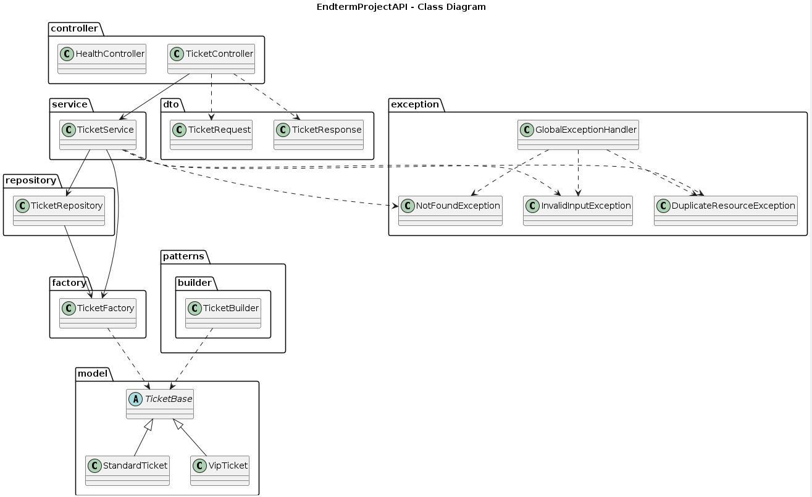
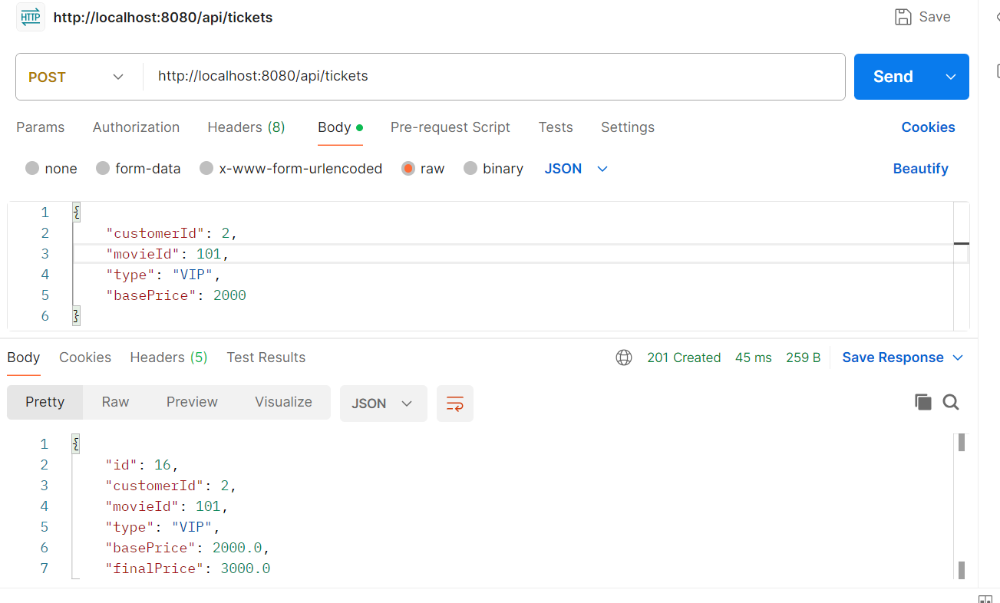
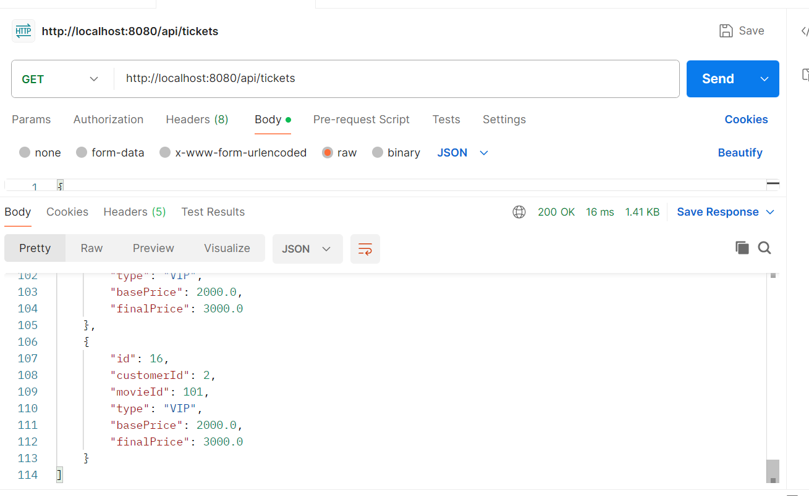
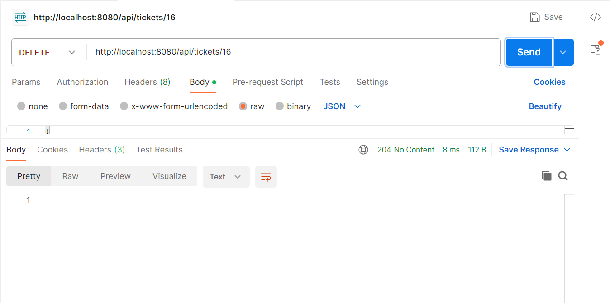
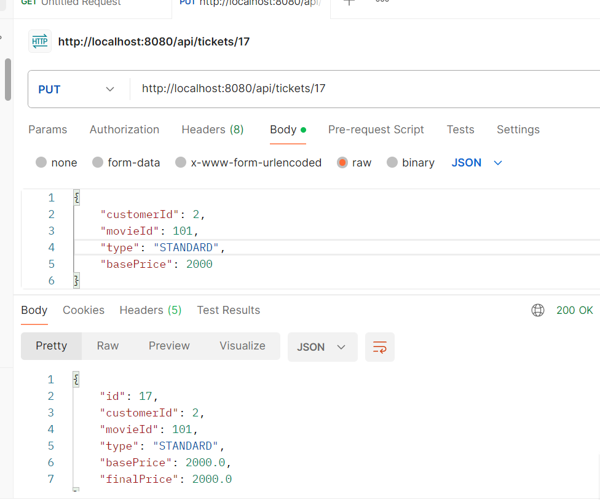

# Endterm Project — Spring Boot REST API with Design Patterns

## Project Overview
This project is a Spring Boot RESTful API developed as a final endterm assignment.  
It integrates *Design Patterns, **SOLID principles, **Component Principles, and **JDBC database access* into a clean layered backend architecture.

The system manages *tickets* with different types (STANDARD, VIP) and demonstrates a complete CRUD REST API with proper validation and error handling.

---

## Technology Stack
- Java 17+
- Spring Boot
- Spring Web
- Spring JDBC
- PostgreSQL
- Gradle
- Postman
- PlantUML

---

## REST API Documentation

### Base URL

http://localhost:8080

### Health Check
*GET*

/health

*Response*
json
OK

---

### Get All Tickets
*GET*

/api/tickets

*Response*
json
[
  {
    "id": 1,
    "customerId": 2,
    "movieId": 101,
    "type": "VIP",
    "basePrice": 2000.0,
    "finalPrice": 3000.0
  }
]

---

### Get Ticket by ID
*GET*

/api/tickets/{id}

*Response*
json
{
  "id": 1,
  "customerId": 2,
  "movieId": 101,
  "type": "VIP",
  "basePrice": 2000.0,
  "finalPrice": 3000.0
}

---

### Create Ticket
*POST*

/api/tickets

*Request Body*
json
{
  "customerId": 2,
  "movieId": 101,
  "type": "VIP",
  "basePrice": 2000
}

*Response (201 Created)*
json
{
  "id": 16,
  "customerId": 2,
  "movieId": 101,
  "type": "VIP",
  "basePrice": 2000.0,
  "finalPrice": 3000.0
}

---

### Delete Ticket
*DELETE*

/api/tickets/{id}

*Response*

204 No Content

---

## Error Handling

The API uses *global exception handling*.

Example error response:
json
{
  "timestamp": "2026-02-08T02:24:54.545059700Z",
  "status": 400,
  "error": "Bad Request",
  "message": "basePrice must be > 0"
}

Handled errors:
- 400 Bad Request — invalid input
- 404 Not Found — resource not found
- 409 Conflict — duplicate ticket
- 500 Internal Server Error — unexpected error

---

## Design Patterns

### Singleton Pattern
*Class:* DatabaseConfig  
*Purpose:*  
Ensures a single shared database configuration instance across the application.

---

### Factory Pattern
*Class:* TicketFactory  
*Purpose:*  
Creates subclasses of the abstract base class TicketBase:
- StandardTicket
- VipTicket

The factory always returns the base type (TicketBase) and supports easy extension.

---

### Builder Pattern
*Class:* TicketBuilder  
*Purpose:*  
Constructs complex ticket objects with validation and optional fields using a fluent API.

---

## Component Principles

### REP (Reuse / Release Equivalence Principle)
Reusable modules are grouped by responsibility:
- controller
- service
- repository
- patterns
- model

---

### CCP (Common Closure Principle)
Classes that change together are packaged together:
- Ticket-related logic inside service and repository
- Pattern implementations inside patterns

---

### CRP (Common Reuse Principle)
Modules depend only on what they use:
- Controllers depend only on services
- Services depend only on repositories and factories

---

## SOLID Principles

- *Single Responsibility* — each class has one clear responsibility
- *Open/Closed* — new ticket types can be added without modifying existing logic
- *Liskov Substitution* — StandardTicket and VipTicket substitute TicketBase
- *Interface Segregation* — clean DTOs for API communication
- *Dependency Inversion* — service depends on abstractions, not implementations

---

## Database Schema

*Table: tickets*

| Column        | Type      |
|--------------|-----------|
| id           | BIGSERIAL |
| customer_id  | BIGINT    |
| movie_id     | BIGINT    |
| type         | VARCHAR   |
| base_price   | DOUBLE    |
| final_price  | DOUBLE    |

---

## System Architecture

Layered architecture:

Controller → Service → Repository → Database

Design patterns are integrated inside the domain and infrastructure layers.

---

## UML Diagram

---

## How to Run the Application

1. Clone the repository
2. Create PostgreSQL database:

endterm_db

3. Configure database credentials in DatabaseConfig
4. Run the application:

./gradlew bootRun

5. Test endpoints using Postman

---

## Postman Screenshots

### Create ticket (POST)

### Get all tickets (GET)

### Get ticket by id

### Delete ticket

### update ticket error

---

## Reflection

This project demonstrates how classical design patterns and component principles can be integrated into a modern Spring Boot REST API.  
It improved understanding of layered architecture, SOLID design, and real-world backend development practices.

---

